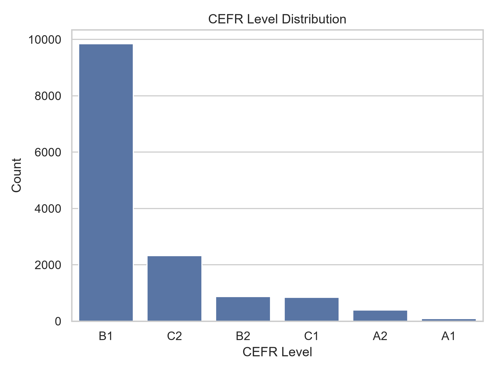
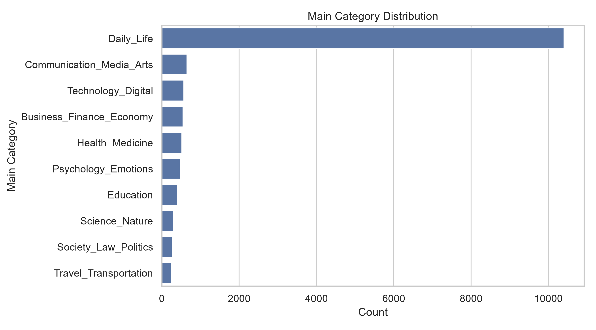
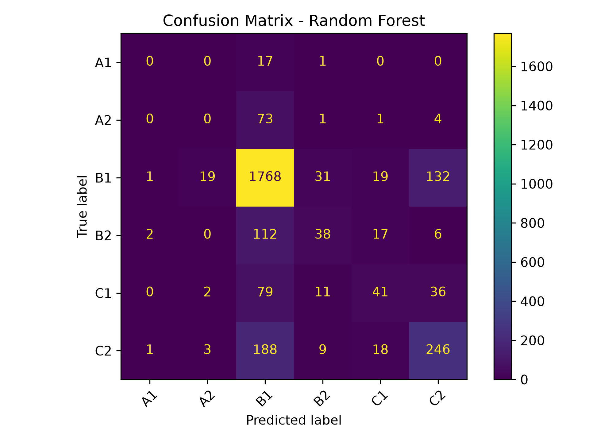
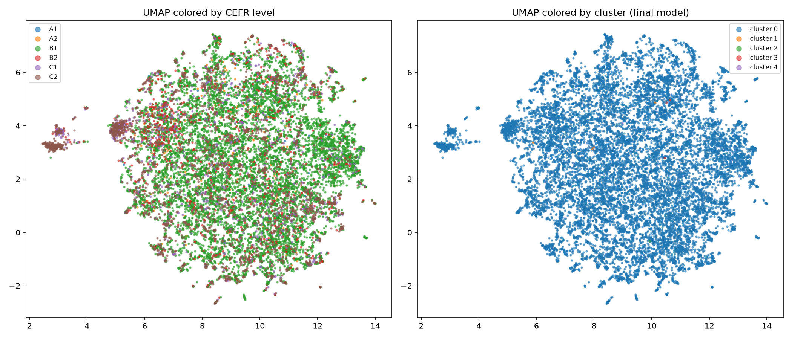

<div align="center">

# 📚 CEFR Lexical Intelligence


</div>

<br>

## 🧠 Overview

CEFR Lexical Intelligence is an end-to-end NLP system for analyzing vocabulary through **semantic embeddings and CEFR proficiency levels**.

The project transforms raw lexical data into a **semantic vector space** and builds multiple intelligence layers on top of it:

- Data cleaning & normalization
- Exploratory data analysis
- Classical machine learning
- Semantic embedding pipeline
- Unsupervised clustering
- CEFR semantic analysis
- Semantic search system
- Category discovery

<br>

---

## 📊 Dataset

| Attribute | Details |
|---|---|
| Raw size | 14,848 phrases |
| Size after cleaning | 14,377 phrases (471 exact duplicates removed) |
| CEFR Levels | A1–C2 |
| Structure | Phrase + Level + Categories |
| Categories | 10 main categories, 51 sub-categories |

<br>

---

## 🏗 Project Pipeline

<br>

### 🟢 Phase 1 — Data Cleaning

- Load raw Excel dataset (`14,848` rows, 5 columns: `#`, `phrase`, `level`, `main category`, `sub category`)
- Drop the leftover row-counter column (`#`) **before** deduplicating — keeping it around was silently preventing duplicate rows from ever being detected
- Deduplicate on the meaningful content columns (`phrase`, `level`, `main category`, `sub category`)
- Normalize phrase text (lowercase, strip whitespace)
- Flag (not drop) phrases with conflicting CEFR levels for manual review

**Actual result:**
- **471 exact duplicate rows removed** → 14,377 rows remain
- **130 phrases flagged** with conflicting CEFR levels (260 rows involved), reviewed manually and kept as-is

**Output:**
- `data/processed/clean_dataset.xlsx` (14,377 rows × 4 columns)

<br>

---

### 🟡 Phase 2 — EDA (Exploratory Data Analysis)

- CEFR distribution analysis
- Main / sub category distribution
- Phrase length analysis
- Data imbalance detection

**Actual results:**

CEFR level distribution (highly imbalanced — B1 dominates):

| Level | Count |
|---|---|
| B1 | 9,846 |
| C2 | 2,324 |
| B2 | 876 |
| C1 | 846 |
| A2 | 394 |
| A1 | 91 |

> ⚠️ Class imbalance ratio (max/min) = **108.2**. Interpret Phase 3 classifier metrics with macro-F1, not accuracy.

Main category distribution (top categories):

| Category | Count |
|---|---|
| Daily_Life | 10,402 |
| Communication_Media_Arts | 650 |
| Technology_Digital | 572 |
| Business_Finance_Economy | 545 |
| Health_Medicine | 521 |
| Psychology_Emotions | 479 |
| Education | 403 |
| Science_Nature | 294 |
| Society_Law_Politics | 269 |
| Travel_Transportation | 242 |

Phrase length: mean **1.64** words, median 1, max 7 words.

**Insight:**
Semantic modeling is more effective than classical feature engineering for this dataset — reflected directly in the Phase 3 baseline results below.

**Outputs (`data/output/` + `data/figures/`):**
- `cefr_level_distribution.png`
- `main_category_distribution.png`
- `sub_category_distribution.png`
- `phrase_length_distribution.png`




<br>

---

### 🟠 Phase 3 — Classical Machine Learning

**Feature extraction:** TF-IDF (unigrams + bigrams, 3,523 features)

**Goal:** Baseline comparison against semantic embeddings (Phase 4+).

**Actual results** (stratified 80/20 split, 11,501 train / 2,876 test):

| Model | Accuracy | F1 (macro) | F1 (weighted) |
|---|---|---|---|
| Random Forest | 0.728 | **0.332** | **0.701** |
| Linear SVM | 0.714 | 0.317 | 0.688 |
| Logistic Regression | **0.734** | 0.274 | 0.674 |

**Key takeaway:** Logistic Regression wins on raw accuracy only because it collapses toward the dominant B1 class (A1/A2 recall = 0.00 for every model). Random Forest gives the best macro/weighted F1 — the more meaningful metric given the 108:1 class imbalance. All three models struggle on minority classes (A1, A2), which is expected from a bag-of-words representation with almost no A1/A2 examples to learn from — this is exactly the gap semantic embeddings (Phase 4+) are meant to close.

**Outputs:**
- `data/output/ml_baseline_comparison.csv`
- `data/figures/confusion_matrix_svm.png`, `confusion_matrix_rf.png`



<br>

---

### 🔵 Phase 4 — Embedding Pipeline (Core System)

- Model: `sentence-transformers/all-MiniLM-L6-v2`
- 384-dimensional sentence embeddings
- Batch encoding (`batch_size=64`)
- Normalized embeddings (cosine-ready space)

This phase converts text into a **semantic vector space representation**.

**Outputs:**

```
data/embeddings/
├── embeddings.npy
├── metadata.csv
└── embedding_config.json
```

**Validation (actual):**
- Shape: `(14377, 384)`
- No NaN / Inf values
- Vector norms: min 0.99999, max 1.00000 (correctly normalized)
- Semantic sanity checks: `teacher↔school = 0.20` (related) vs. `teacher↔car = 0.05` (unrelated) — embeddings correctly separate related/unrelated concepts

**Key Insight:**
The dataset is now represented as a geometric semantic space, enabling similarity search and clustering.

<br>

---

### 🟣 Phase 5 — Clustering (Unsupervised Learning)

Applies unsupervised learning to the Phase 4 embeddings to discover hidden
semantic structure, **without using CEFR labels**. Implemented as a
reproducible pipeline (`src/clustering.py`) in five steps:

1. **Prepare Embedding Space** (PCA + UMAP projections)
2. **Apply Multiple Clustering Algorithms** (KMeans k=2–10, DBSCAN, Hierarchical)
3. **Evaluate Clustering Quality** (silhouette, Davies-Bouldin, Calinski-Harabasz)
4. **Select Best Model**
5. **Cluster Analysis** (representative samples, nearest examples)

**Actual result:**

| Algorithm | k | Silhouette |
|---|---|---|
| **Hierarchical** | **5** | **0.076** |
| KMeans | 2 | 0.045 |
| KMeans | 9 | 0.038 |
| DBSCAN | — | -0.025 |

Hierarchical clustering (k=5) is selected as the winning model, but its silhouette score is low in absolute terms, and the cluster sizes confirm why: **one cluster holds 14,368 of 14,377 samples (99.9%)**, with the remaining 4 clusters being tiny (4, 1, 3, and 1 samples) — tight thematic outlier groups (e.g. cancer-related terms, wifi/hotspot terms) rather than a balanced partition of the vocabulary. This is explored further in Phase 6.

**Outputs (`data/clustering/`):**
`kmeans_labels.csv`, `dbscan_labels.csv`, `hierarchical_labels.csv`, `final_cluster_labels.csv`, `comparison_table.csv`, `cluster_metrics.json`, `clustering_config.json`, `representative_samples.csv`, `nearest_examples.csv`, `embedding_projections.csv`

<br>

---

### 🔵 Phase 6 — CEFR Analysis

Compares CEFR labels against the Phase 5 clusters to see whether semantic similarity and language-proficiency level line up.

**Actual result — primary model (`final_cluster_labels`, Hierarchical k=5):**
Because the winning model is 99.9% one giant cluster, this comparison mostly just re-describes the overall CEFR distribution (purity 0.68, entropy 1.47 bits) and isn't very informative on its own — **3,259 phrases** get flagged as "mismatched" purely because the dominant cluster spans every CEFR level.

**Secondary comparison — `kmeans_labels` (k=2), more balanced:**

| Cluster | Size | Dominant level | Purity | Entropy (bits) |
|---|---|---|---|---|
| 0 | 3,767 | B1 | 0.42 | 1.86 |
| 1 | 10,610 | B1 | 0.78 | 1.21 |

This split is actually informative: cluster 0 mixes CEFR levels much more (higher entropy, more C1/C2 content — 33.5% C2 vs 10.0% in cluster 1), suggesting the semantic space does carry *some* CEFR-related structure, just not one that a single hierarchical clustering run captures well at k=5.

**Data-quality note:** the 130 phrases with conflicting CEFR levels (flagged in Phase 1) were manually reviewed and found consistent enough to keep as-is; `cefr_level_conflicts.csv` is no longer needed and has been removed.

**Outputs (`data/output/` + `data/figures/`):**
- `cefr_final_crosstab_counts.csv`, `cefr_final_crosstab_pct.csv`, `cefr_final_cluster_summary.csv`, `cefr_final_mismatches.csv`
- `cefr_kmeans_crosstab_counts.csv`, `cefr_kmeans_crosstab_pct.csv`, `cefr_kmeans_cluster_summary.csv`, `cefr_kmeans_mismatches.csv` *(kept — this is the only genuinely informative CEFR-vs-cluster comparison, given the primary model's imbalance)*
- `cefr_vs_cluster_umap.png`



<br>

---

### 🟡 Phase 7 — Semantic Search System

- Query → embedding conversion (same model as Phase 4)
- Cosine similarity ranking against `embeddings.npy`
- Top-K retrieval system
- Optional filtering by CEFR level / main category / sub category

This phase transforms embeddings into a **search engine-like system**. No embeddings are recomputed — it reuses Phase 4's artifacts directly.

**Actual demo results** (from `src/search.py`'s built-in demo queries):

*Query: "talk about money problems"*

| Phrase | Level | Similarity |
|---|---|---|
| recovery of money | B1 | 0.596 |
| squander money (on) | C2 | 0.593 |
| change money | C1 | 0.589 |
| money is tied up in | C2 | 0.567 |
| throw money around | C2 | 0.561 |

*Query: "feeling nervous before an exam" (filtered to level B1/B2)*

| Phrase | Level | Similarity |
|---|---|---|
| nervous | B1 | 0.609 |
| do an exam | B2 | 0.557 |
| anxious | B1 | 0.496 |
| examination | B1 | 0.492 |
| pre-wedding nerves | B1 | 0.477 |

*Query: "using a computer or the internet" (filtered to `Technology_Digital`)*

| Phrase | Level | Similarity |
|---|---|---|
| internet | B1 | 0.667 |
| use a laptop | C1 | 0.609 |
| computer | B1 | 0.598 |
| web | B1 | 0.490 |
| fast computer | C2 | 0.488 |

All three demos retrieve clearly on-topic, correctly-filtered results — a good sign the embedding space (Phase 4) is semantically sound even though the *clustering* on top of it (Phase 5) turned out to be heavily imbalanced.

**Output:** none saved to disk (a callable `search()` function); see `src/search.py`.

<br>

---

### 🟣 Phase 8 — Category Discovery

- Unsupervised cluster interpretation (signature phrases per cluster, from `representative_samples.csv`)
- Comparison with the original main/sub-category taxonomy (crosstab, purity, entropy)
- Quantitative alignment: Adjusted Rand Index and Normalized Mutual Information

**Actual result:**

| Cluster | Size | Closest category | Purity | Signature phrases |
|---|---|---|---|---|
| 0 | 14,368 | Daily_Life / General_Interactions | 0.72 | clean, something, action, inquiry, job |
| 1 | 4 | Daily_Life / General_Interactions | 0.75 | wireless hotspot, wi-fi hotspots, use satnav, swipe a card |
| 2 | 1 | Education / Exams_Assessments | 1.00 | valid passport |
| 3 | 3 | Health_Medicine / Nutrition_Diet | 0.67 | calorie, calories, anti-aging properties |
| 4 | 1 | Daily_Life / General_Interactions | 1.00 | widening gulf |

**ARI = 0.0006, NMI = 0.0014** — essentially zero alignment between the discovered clusters and the hand-made taxonomy overall, which is expected given cluster 0 alone holds 99.9% of the data. The real signal is in the 4 tiny outlier clusters: each is a clean, single-topic discovery (wifi/hotspot terms, a lone "valid passport", diet/calorie terms, one idiom) rather than anything resembling a new alternative category system.

**Outputs (`data/output/`):**
- `category_discovery_crosstab_counts.csv`, `category_discovery_crosstab_pct.csv`
- `category_discovery_report.csv`
- `category_discovery_alignment_metrics.txt`

<br>

---

## ⚡ Core Principles

- Embeddings are generated once and reused across all phases
- Phase 4 is the foundation of the entire system
- All downstream tasks depend on embedding space consistency
- Metadata and embeddings are strictly separated
- Reproducibility is ensured via configuration files

<br>

---

## 📁 Project Structure

```text
cefr-project/
│
├── data/
│   ├── raw/
│   │   └── toefl_vocabulary_cleaned_categorized.xlsx
│   ├── processed/
│   │   └── clean_dataset.xlsx
│   ├── embeddings/
│   │   ├── embeddings.npy
│   │   ├── metadata.csv
│   │   └── embedding_config.json
│   ├── clustering/
│   │   ├── kmeans_labels.csv           # best-of-KMeans only
│   │   ├── dbscan_labels.csv
│   │   ├── hierarchical_labels.csv
│   │   ├── final_cluster_labels.csv    # labels from the overall winning algorithm
│   │   ├── cluster_metrics.json        # best_model / all_results / selection_criterion
│   │   ├── clustering_config.json      # selected algorithm, params, embedding model, metrics
│   │   ├── comparison_table.csv        # all algorithms x k, sorted by silhouette
│   │   ├── representative_samples.csv  # closest samples to each cluster centroid
│   │   ├── nearest_examples.csv        # phrase/level/category for representative samples
│   │   └── embedding_projections.csv   # sample_id, pca_1/2, umap_1/2 (reused, never recomputed)
│   │
│   ├── figures/                        # all PNG plots from Phases 2, 3, 6
│   └── output/                         # all CSV/TXT reports from Phases 2, 3, 6, 8
│
├── experiments/
│   └── clustering/
│       ├── intermediate_results/
│       ├── model_search_results/       # per-k KMeans label files (k=2..10)
│       └── experimental_plots/
│
├── notebooks/                          # optional — not required to run the pipeline
│   ├── 01_clean_data.ipynb
│   ├── 02_eda.ipynb
│   ├── 03_classical_ml.ipynb
│   ├── 04_embeddings_pipeline.ipynb
│   ├── 05_clustering_analysis.ipynb
│   ├── 06_cefr_analysis.ipynb
│   ├── 07_similarity_search.ipynb
│   └── 08_category_discovery.ipynb
│
├── src/
│   ├── data_cleaning.py        # Phase 1
│   ├── eda.py                  # Phase 2
│   ├── ml_models.py            # Phase 3
│   ├── embeddings.py           # Phase 4
│   ├── clustering.py           # Phase 5
│   ├── cefr_analysis.py        # Phase 6
│   ├── search.py               # Phase 7
│   └── category_discovery.py   # Phase 8
│
├── main.py
├── requirements.txt
├── README.md
└── .gitignore
```

> **Notebooks are optional.** Every phase already runs end-to-end as a plain script in `src/`. The notebooks listed above are just thin wrappers for interactive exploration — nothing in the pipeline depends on them. Skip them unless you specifically want a notebook-based walkthrough.

<br>

---

## ▶️ Running the pipeline

Each phase can be run individually:

```bash
python src/data_cleaning.py
python src/eda.py
python src/ml_models.py
python src/embeddings.py
python src/clustering.py
python src/cefr_analysis.py
python src/category_discovery.py
```

`src/search.py` is not a pipeline step — import `search()` from it, or run it directly for a demo:

```bash
python src/search.py
```

Or run everything in order (Phases 1–6 + 8) with:

```bash
python main.py
```

